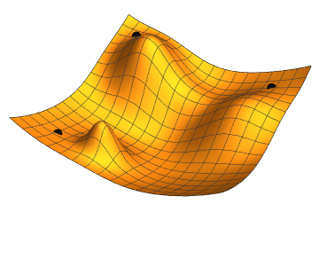

# Adam — A Method for Stochastic Optimization

> Kingma & Ba, *Adam: A Method for Stochastic Optimization*, ICLR 2015.

Most-cited optimizer paper in ML. Reimplemented in ~20 lines so you can see there's no magic — just two running averages and a bias correction.

<p align="center">
  
</p>

<sub><i>Image: Wikimedia Commons, public domain. Not Adam specifically — just the general "roll downhill" picture every optimizer is trying to do.</i></sub>

## Where Adam comes from (in one minute)

- **SGD**: take the gradient, take a step. If the landscape is a narrow canyon, you oscillate side-to-side like a shopping cart with a bad wheel.
- **Momentum**: average recent gradients. Oscillations cancel, downhill direction reinforces. Shopping cart now rolls.
- **RMSProp**: divide each parameter's step by a running estimate of its own gradient magnitude. Params with huge gradients take small steps, params with tiny gradients take big steps. Everyone arrives together.
- **Adam** = momentum + RMSProp + a bias-correction hack because both running averages start at zero, which makes the first few steps underestimate reality.

That's the whole paper. The bias correction is the clever bit: `m̂ = m / (1 - β^t)` unbiases an exponentially-weighted average that started from zero.

## The update rule

```
g_t  = ∇θ L(θ_{t-1})
m_t  = β1 · m_{t-1} + (1 - β1) · g_t           # 1st moment (mean)
v_t  = β2 · v_{t-1} + (1 - β2) · g_t²          # 2nd moment (variance proxy)
m̂_t  = m_t / (1 - β1^t)                        # bias correction
v̂_t  = v_t / (1 - β2^t)
θ_t  = θ_{t-1} - lr · m̂_t / (√v̂_t + ε)
```

Defaults the paper picked and nobody ever changes: `lr=1e-3, β1=0.9, β2=0.999, ε=1e-8`.

## Files

| File | What |
|---|---|
| `adam_scratch.py` | The update rule above, literally. No `Optimizer` base class, no dispatcher, no fused CUDA path. |
| `adam_library.py` | `torch.optim.Adam`. Same math, written in C. |
| `test_adam.py` | Verifies scratch produces the exact same trajectory as `torch.optim.Adam` on quadratic + non-convex losses. |

## Run it

```bash
python3 adam_scratch.py
python3 adam_library.py
python3 -m pytest test_adam.py -v -p no:anyio
```

Both print `converged to x = 3.000000 (target = 3.0)`. Because it's the same algorithm.

## What to notice

- The scratch version reproduces `torch.optim.Adam` **to `1e-6` float error**, step for step. That's not "similar behavior" — that's bit-identical math.
- The bias-correction test would fail without the `/ (1 - β^t)` trick: early updates would be ~30× smaller than they should be.
- `torch.optim.Adam` does this in a fused kernel and has foreach/fused variants for speed, but the arithmetic is exactly what you see in 20 lines.

## References

- Kingma & Ba — [Adam: A Method for Stochastic Optimization](https://arxiv.org/abs/1412.6980)
