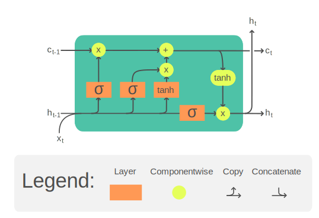

# LSTM — Long Short-Term Memory

> Hochreiter & Schmidhuber, *Long Short-Term Memory*, Neural Computation, 1997.
> Gers, Schmidhuber, Cummins, *Learning to Forget: Continual Prediction with LSTM*, 2000 (forget gate).

Two implementations of the same LSTM cell, same weights, same input — so you can see exactly what `torch.nn.LSTM` is doing behind the curtain.

## The cell, visually

<p align="center">
  
</p>

<sub><i>Image: Wikimedia Commons, CC BY-SA 4.0.</i></sub>

Read it left-to-right, one timestep at a time. Three things flow *in* at step `t`:

- **`x_t`** — the new input (bottom).
- **`h_{t-1}`** — the previous hidden state (left, bottom line).
- **`c_{t-1}`** — the previous cell state (left, top line — the "conveyor belt").

Inside the cell, four little neural nets (the yellow σ/tanh boxes) look at `[x_t, h_{t-1}]` and each produce a vector:

| Gate | Activation | What it decides |
|---|---|---|
| **`f_t`** forget | σ → (0,1) | How much of the old cell state `c_{t-1}` to keep. `0` = wipe, `1` = keep all. |
| **`i_t`** input | σ → (0,1) | How much of the new candidate to *write* into the cell. |
| **`g_t`** candidate | tanh → (-1,1) | *What* to potentially write (the new info itself). |
| **`o_t`** output | σ → (0,1) | How much of the updated cell to expose as `h_t`. |

Then the two state updates (the pointwise ⊙ and ⊕ ops on the top line):

```
c_t = f_t ⊙ c_{t-1}  +  i_t ⊙ g_t      # forget some old, add some new
h_t = o_t ⊙ tanh(c_t)                    # read out a filtered view
```

The trick is that **cell-state updates are additive, not multiplicative**. A vanilla RNN re-multiplies the hidden state by a weight matrix every step, so gradients explode or vanish. In an LSTM, when `f_t ≈ 1` the cell state just flows forward untouched — the gradient highway that made 100-step credit assignment tractable in 1997 and kept RNNs relevant until Transformers ate their lunch.

## The math

At each timestep `t`, given input `x_t` and previous state `(h_{t-1}, c_{t-1})`:

```
i_t = σ(x_t W_ii + b_ii + h_{t-1} W_hi + b_hi)     input gate
f_t = σ(x_t W_if + b_if + h_{t-1} W_hf + b_hf)     forget gate
g_t = tanh(x_t W_ig + b_ig + h_{t-1} W_hg + b_hg)  candidate
o_t = σ(x_t W_io + b_io + h_{t-1} W_ho + b_ho)     output gate
c_t = f_t ⊙ c_{t-1} + i_t ⊙ g_t                    new cell state
h_t = o_t ⊙ tanh(c_t)                              new hidden state
```

Four gates, one cell state that carries long-range info, one hidden state that's the output. The forget gate is what lets gradients survive across long sequences — multiply by ≈1 and the gradient doesn't vanish.

## The backward pass (BPTT)

Training an RNN means backpropagating through *time* — unroll the cell across `T` steps and apply chain rule in reverse. The scratch version caches `(i, f, g, o, c, h_{t-1}, c_{t-1})` per step during forward, then walks `t = T-1 → 0` applying:

```
dc_t   = dh_t ⊙ o_t ⊙ (1 - tanh(c_t)²)  +  dc_{t+1}
do     = dh_t ⊙ tanh(c_t)
df     = dc_t ⊙ c_{t-1}           di = dc_t ⊙ g_t           dg = dc_t ⊙ i_t
dc_{t-1} = dc_t ⊙ f_t
```

Each gate-grad is then pushed through its activation derivative (`σ(1-σ)` for sigmoid gates, `1 - tanh²` for the candidate), stacked into a `[B, 4H]` pre-activation grad, and used to accumulate `dW_ih`, `dW_hh`, `db`, `dx_t`, and `dh_{t-1}`.

The library version skips all of that. `out.backward(dOut)` — autograd replays the recorded forward graph in reverse. That's the whole value proposition of a framework.

## Files

| File | What |
|---|---|
| `lstm_scratch.py` | Forward *and* manual BPTT. Pure `torch` tensor ops — no `nn.Module`, no `nn.LSTM`, no `autograd`. |
| `lstm_library.py` | Thin wrapper over `torch.nn.LSTM`. Autograd does backward for free. |
| `compare.py` | Loads identical weights into both, runs same input and same upstream grad, checks forward *and* gradient agreement + times both. |
| `test_lstm.py` | Pytest suite: 12 tests covering forward shapes, forward-vs-library, backward-vs-autograd, backward-vs-finite-difference, initial states, and weight loading. |

Weight layout matches PyTorch's (`[4H, I]`, gate order `i, f, g, o`) so weights copy across cleanly.

## Run it

```bash
python3 compare.py                          # benchmark + numerical check
python3 -m pytest test_lstm.py -v           # 12 tests, ~1s
# if pytest complains about an anyio plugin, add: -p no:anyio
```

## Actual output

```
config: batch=16  seq_len=50  input_size=32  hidden_size=64

==============================================================
                                   scratch           library
--------------------------------------------------------------
forward (ms)                         3.849             0.389
forward+backward (ms)               13.322             1.156
fwd speedup (lib/sc)                                   9.89x
fwd+bwd speedup                                       11.52x
==============================================================

forward agreement:
  max |Δ output|         = 1.043e-07

backward agreement (manual BPTT vs autograd, same weights/input/dOut):
  max |Δ d_weight_ih|    = 1.144e-05
  max |Δ d_weight_hh|    = 1.997e-06
  max |Δ d_bias_ih|      = 2.670e-05
  max |Δ d_bias_hh|      = 2.670e-05
  max |Δ d_x|            = 1.788e-07

  worst diff overall     = 2.670e-05  (✅ match)
```

## What this tells you

- **Forward matches to ~1e-7.** Float32 roundoff, nothing more — the scratch cell *is* the PyTorch LSTM.
- **Manual BPTT matches autograd to ~1e-5.** Slightly looser than forward because bias grads accumulate `B × T = 800` floats before compare; `1e-7 × 800 ≈ 1e-4` is the noise floor. Your chain rule is right.
- **~10× slower forward, ~12× slower forward+backward.** The library uses fused CUDA/MKL kernels (`_VF.lstm`) that batch the four gate matmuls into one, reuse intermediate buffers, and avoid the Python `for t in range(T)` loop. The scratch version pays Python interpreter overhead at every timestep, twice (forward and backward).
- **The abstraction isn't hiding any math.** It's hiding a C++ kernel call and a graph-replay autograd engine. You just wrote both.

*CPU, single thread, PyTorch 2.10. Numbers vary run-to-run.*
