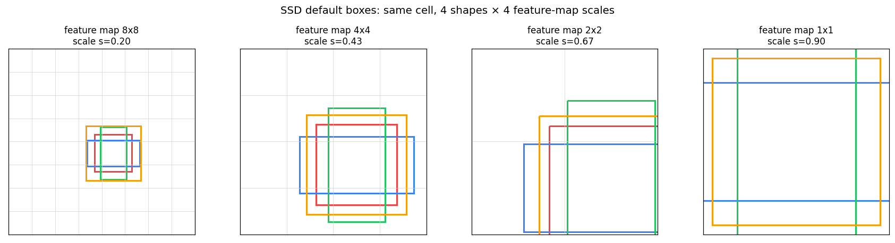

# SSD — Single Shot MultiBox Detector

> Liu et al., *SSD: Single Shot MultiBox Detector*, ECCV 2016.

The single-stage answer to Faster R-CNN's two-stage pipeline. One forward pass, no region-proposal stage, runs in real-time. Made the detector-speed/accuracy Pareto frontier a lot more interesting for three years until RetinaNet and YOLO v3 ate its lunch.

<p align="center">
  
</p>

<sub><i>Generated by this repo: one cell, same position, 4 aspect-ratio-varied default boxes, shown across 4 feature-map resolutions. As feature maps get smaller, the default boxes get bigger relative to the input — that's the whole multi-scale trick.</i></sub>

## Honest disclaimer

Like Faster R-CNN, a full SSD is a thousand+ lines of backbone + extras + heads + loss wiring. This folder focuses on the **three algorithmic contributions** the paper is actually remembered for:

1. **Default boxes** — anchors, but laid out across a feature pyramid with a specific scale schedule
2. **Multi-scale detection** — the architectural reason SSD handles objects of wildly different sizes
3. **Hard negative mining** — SSD's fix for the 100,000-negatives-vs-few-positives class-imbalance problem

## First principles

### The single-shot idea

Two-stage detectors (Faster R-CNN) first propose ~1000 regions of interest, then classify each. Accurate, slow. SSD said: *skip the proposals*. Just dense-predict class + box at every cell of every feature map in a pyramid. One forward pass, no second network. Trade: lower accuracy (especially for small objects in early versions), dramatically faster.

### The scale schedule

If you only detect on one feature map, you'll be good at one size of object and bad at others. The SSD trick: pick `m` feature maps at progressively coarser resolutions (e.g. 38×38, 19×19, ..., 1×1) and run detection on each. Early maps see small objects; late maps see large ones.

For each map `k ∈ 1..m`, assign a default-box scale:

```
s_k = s_min + (s_max - s_min) · (k - 1) / (m - 1)      # linear interpolation
```

The paper's defaults: `s_min=0.2`, `s_max=0.9`. Plus `s'_k = √(s_k · s_{k+1})` — an extra "in-between" square box per cell that fills scale gaps.

### Default boxes per cell

Per cell, produce:
- One box of scale `s_k` for each aspect ratio `{1, 2, 1/2}` (and optionally `{3, 1/3}` for extra coverage)
- One extra square box of scale `s'_k`

Typical count: 4 or 6 boxes per cell. The default configuration in this repo uses `(1.0, 2.0, 0.5)` + one extra = 4 per cell.

### Hard negative mining

At inference over, say, 8000 default boxes across the pyramid, fewer than 20 match any ground-truth object. Training on all 8000 with standard cross-entropy → the network learns "always predict background" and achieves 99.8% accuracy while detecting nothing.

SSD's fix is embarrassingly simple: for each image, take all `P` positive (matched) boxes and the `3P` hardest negatives (highest classification loss), discard the rest. The 1:3 ratio is a magic number the paper settled on empirically. Focal Loss (RetinaNet, 2017) later replaced this with a smoother reweighting, but for SSD, this hack is what made training actually converge.

## Files

| File | What |
|---|---|
| `ssd_scratch.py` | Scale schedule, default-box generation for single map + full pyramid, cx/cy ↔ xy format helpers, hard negative mining. Pure tensor ops. |
| `ssd_library.py` | `torchvision.models.detection.ssd300_vgg16` — the full pipeline. |
| `test_ssd.py` | 11 tests: scale endpoints and monotonicity, geometric-mean `s'_k`, per-cell box count + centering, full-pyramid box count for SSD300 config, format-conversion roundtrip, HNM ratio + correctness + cap edge case. |

## Run it

```bash
python3 ssd_scratch.py
python3 -m pytest test_ssd.py -v -p no:anyio
# full library smoke test:
python3 ssd_library.py
```

## What to notice

- The scale schedule is a two-line formula that fully determines where each feature map looks. Everything else about SSD's "multi-scale magic" is just plumbing on top.
- **Hard negative mining works because losses are informative.** The hardest negatives (highest loss) are the ones the network is currently confusing with real objects — exactly where you want gradient signal. A random sample would dilute training with easy "obviously background" examples.
- Default boxes are in **(cx, cy, w, h) normalized coords**, not absolute pixels. This makes the matching code image-size-agnostic and matches how the paper writes the formulas.
- "SSD-ResNet" (this folder's name) is just SSD with a ResNet backbone swapped in for VGG. The SSD paper uses VGG; the algorithmic ideas are backbone-agnostic.

## References

- Liu et al. — [SSD: Single Shot MultiBox Detector](https://arxiv.org/abs/1512.02325)
- Lin et al. — [Focal Loss (RetinaNet)](https://arxiv.org/abs/1708.02002) — the paper that replaced SSD's hard negative mining with a smoother idea.
